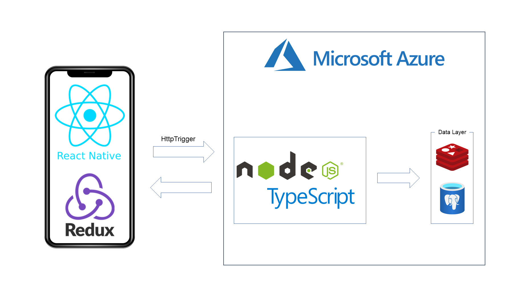
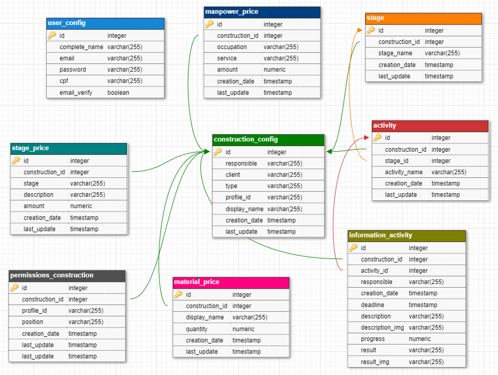

# Construction Management API

This project was implemented to my Final paper. We going to talk about backend tecnologies used in this project. We also will talk about architeture planned to the entire project, who involves Node.JS, TypeScript, Azure, PostgreSQL, Redis, React Native and Redux.

---

### About
The objective of this project was implement a software who can help many professionals about construction. So, this include engineers, architects, masons and other profressionals or clients. This software will help any user who wish make an construction. Professionals like enginners and architects will be a chef, a administrator of the project. Masons and others will be a employee. Clients, well, will be a client.

So, the objective is provide access and visibility about the construction for both, the administrator and the client, who will be able to view the building from anywhere, and track the progress.

### Skills
- Node.JS
- Microsoft Azure
- TypeScript
- PostgreSQL
- Redis
- Typeorm

### Architecture
A whole application backend will be running in the Microsoft Azure. To implement the solution, we are using serverless with HttpTriggers that will enable communication with Frontend application and Backend application. 

On backend, we are using Node.JS with TypeScript to implement our functions and PostgreSQL to store our data. Redis is used like a memory bank to store the accessToken and the refreshToken, this way we can search on him and look for a user connected.

<h1 align="center">
    
</h1>

We also divide our implementation im many projects and we gave responsibilities to each one. Look the Table for more explanation.

| **Name** | **Description** |
| ------------ | ------------ |
| func-user | Contains all user related functions. Ex: Login, logout, register.. |
| func-construction | Contains all construction related functions such as functions to create a new construction, rescue steps, activities, information and everything related. |
| func-price | Contains all the functions related to price tables. Ex: materials, manpower, stage.. |
| func-db-migrations | Contains all migrations of tables in the database. This mini project is useful to centralize all project migrations integer, and separate what belongs only to the bank. |

---

##### Func-user
We centralize all verificiations and access permissions about user in this project. Here we generate a hash with bcrypt library to create a hash by password to save in the database. We using this library also to compare the hash in the database and the new hash created by the password that user provided.
We are using JWT to create our accessToken and the library accesscontrol to control our permissions by type of user.
You can look the whole implementation in this link: [func-user](https://github.com/LeoInCode/construction_management-api/tree/main/func-user "func-user")

---
##### func-db-migrations
We centralize all migrations in this project to have more controle about the fields and tables who are created in the database. We are using Typeorm, he is a ORM that can provide more facility to connecte the database, and also to create the tables.
<h1 align="center">
    
</h1>
You can look the whole implementation in this link: [func-db-migrations](https://github.com/LeoInCode/construction_management-api/tree/main/func-db-migrations "func-db-migrations")

---
##### func-construction AND func-price
Both projects are very similar in one point, both in all requests do a request to func-user, in the function getUser, try to get access to the functionalities.
The different between each other is func-construction centralize all informations about constructions, informations, steps, activities, and func-price centralize all informations about price, this include table of prices and graphics.
You can look the whole implementation about both project in these links: [func-construction](https://github.com/LeoInCode/construction_management-api/tree/main/func-construction "func-construction") [func-price](https://github.com/LeoInCode/construction_management-api/tree/main/func-price "func-price")